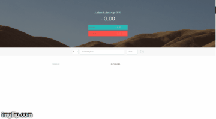

# Budget App

A simple JavaScript based app to add Income and Expenses using Modular pattern

This application makes use of function constructors, IIFE, prototype,  DOM Manipulations, string manipulations, event listeners, callback functions and DRY principles.

